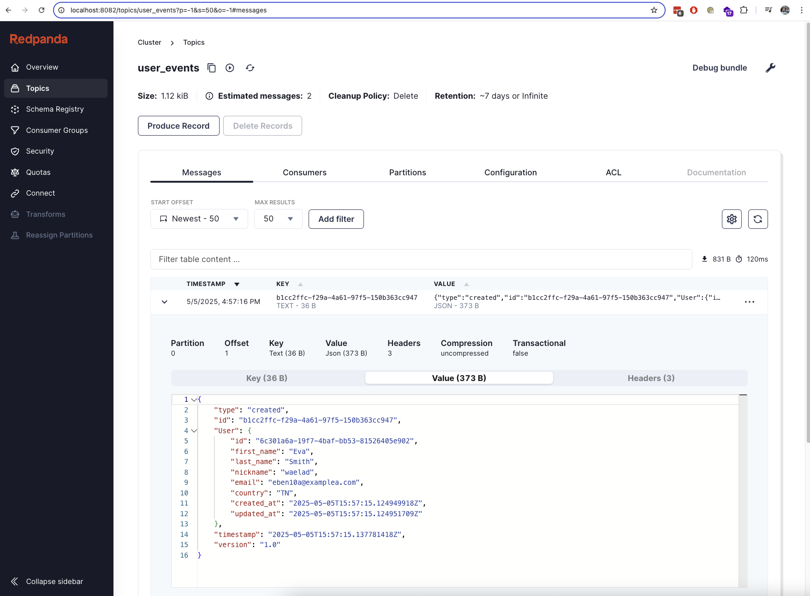
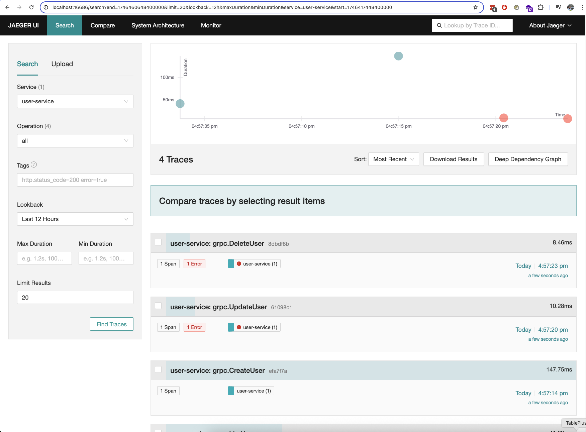
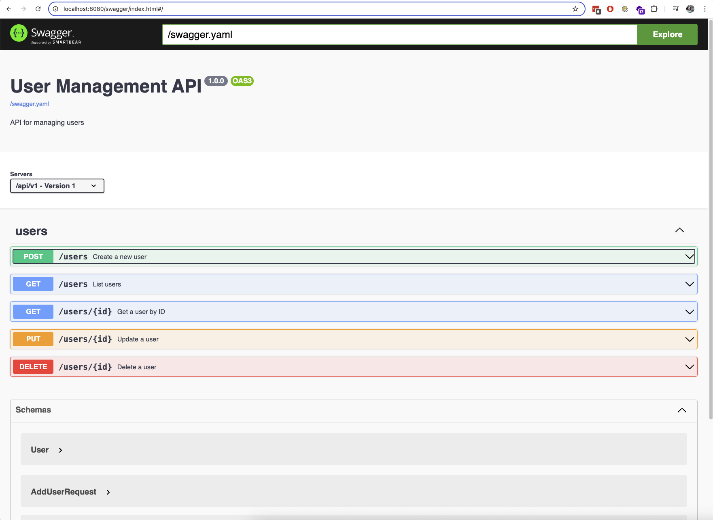

# Faciet - User Management Service

This project is a user management service built with Go, designed to be robust, scalable, maintainable, and observable, implementing clean architecture principles and modern cloud-native practices.

## Core Functionality

* **User Management:** Full CRUD (Create, Read, Update, Delete) operations for user entities.
* **Advanced Listing:** Retrieve paginated lists of users with server-side filtering (by various fields) and sorting.
* **Dual APIs:** Exposes functionality via both a RESTful HTTP API (documented with Swagger) and an efficient gRPC API (documented with proto files).
* **Event Streaming:** Publishes user lifecycle events (Created, Updated, Deleted) to a Kafka topic for consumption by other services or systems.

## Key Benefits & Architectural Advantages

This project isn't just about functionality, it's built with specific design goals that yield significant benefits:

**1. Maintainability & Readability:**
* **Clean Architecture:** Strict separation of concerns (domain logic, data persistence, API handling, platform utilities) makes the codebase easier to understand, navigate, and modify without unintended side effects. Changes in one layer (e.g., database schema) have minimal impact on others (e.g., API handlers).
* **Interface-Driven Design:** Key components like the `Repository` and `Publisher` are defined by interfaces, decoupling the core `Service` logic from specific implementations (e.g., Postgres, Kafka). This allows implementations to be swapped easily.
* **Go Language Benefits:** Leverages Go's simplicity, strong typing, built-in concurrency features, and excellent tooling for a clean and efficient codebase.

**2. Testability:**
* **High Unit Test Coverage:** Comprehensive unit tests are provided for various components, including repository interactions (using mocks like `sqlmock` and `redismock`), caching logic, domain service logic, platform utilities (logging, tracing, config), and API health checks. This ensures individual components function correctly in isolation.
* **Mocking Enabled:** The use of interfaces and dependency injection makes it straightforward to mock dependencies (like the database or cache) during testing, leading to faster and more reliable tests.
* **Clear Test Structure:** Tests are located alongside the code they test (`_test.go` files), making them easy to find and maintain.

**3. Scalability & Performance:**
* **Horizontal Scalability:** The core Go service is designed to be stateless, allowing multiple instances to run behind a load balancer to handle increased traffic.
* **Read Performance (Caching):** The `CacheDecorator` significantly improves read performance by caching user data in Redis. This reduces load on the primary PostgreSQL database for frequent lookups (GetByID, GetByEmail, GetByNickname). Cache invalidation logic ensures data consistency during updates and deletes.
* **Write Scalability & Resilience (Kafka):** Publishing events to `Kafka`  decouples the user service from downstream consumers. This allows the service to handle writes quickly without waiting for consumers, provides load buffering, and ensures events are persisted even if consumers are temporarily unavailable.
* **Efficient API (gRPC):** Offering a gRPC API alongside REST provides a high-performance, low-latency option for inter-service communication, using efficient Protobuf serialization.
* **Database Connection Pooling:** Configurable connection pooling for PostgreSQL optimizes database interactions.

**4. Observability & Monitoring:**
* **Distributed Tracing:** Integrated `OpenTelemetry` provides end-to-end tracing of requests as they flow through the service (and potentially across multiple services). The included Jaeger setup (`docker-compose.yml`) allows visualization of these traces, drastically simplifying debugging and performance analysis in complex environments. Spans include relevant attributes (like user ID, email). 
***PS:*** As for now it's enabled only on gRPC endpoints
* **Structured Logging:** Uses Go's standard `slog` library to produce JSON-formatted logs. This structured format is easily parseable by log aggregation tools (like ELK stack, Splunk, Datadog), enabling powerful querying, filtering, and alerting based on log data. Log levels are configurable.
* **Comprehensive Health Checks:** The `/healthz` endpoint (`internal/api/health.go`) actively checks the status of critical dependencies (PostgreSQL, Redis, Kafka), providing a clear signal for monitoring systems and load balancers about the service's operational readiness.

**5. Production Readiness & Reliability:**
* **Robust Configuration:** Centralized configuration loading (`internal/config/config.go`) via Viper handles environment variables and `.env` files, with validation and sensible defaults, ensuring consistent behavior across environments.
* **Graceful Shutdown:** The service correctly handles `SIGINT` and `SIGTERM` signals (`cmd/server/main.go`), allowing active requests to complete before shutting down, preventing data loss or abrupt connection termination.
* **Rate Limiting:** Protects the API endpoints (both REST and gRPC via interceptors) from excessive traffic or abuse using a configurable token bucket algorithm.
* **Dependency Management:** Uses Go Modules for clear and reproducible dependency management.
* **Database Migrations:** Employs `golang-migrate` (`migrations/`, `makefile`) for version-controlled, systematic database schema management, crucial for reliable deployments and rollbacks.
* **Clear Error Handling:** Defines specific error types in the domain layer and maps them appropriately to API responses (HTTP status codes in REST, gRPC status codes), providing clear feedback to clients.

**6. Developer Experience (DX):**
* **Automated Tasks (Makefile):** The `Makefile` automates common tasks like setup, building, testing, linting, running, generating code (protobufs), managing Docker containers, and applying migrations, streamlining the development workflow.
* **Containerized Environment (Docker):** `docker-compose.yml` provides a one-command (`make compose-up`) setup for the entire application stack (app, database, cache, message broker, tracing UI), ensuring consistency and ease of onboarding for new developers.
* **API Documentation (Swagger):** The REST API is documented using OpenAPI (Swagger) specifications (`doc/swagger.yaml`), served via a UI (`/swagger/index.html`), making the API easy to explore and interact with.
* **Code Generation:** Automates the generation of gRPC Go code from `.proto` definitions (`make generate-proto`), reducing boilerplate and ensuring consistency.

**7. Flexibility & Extensibility:**
* **Dual API Strategy:** Supporting both REST and gRPC allows the service to integrate with a wider range of clients and systems, choosing the best protocol for each use case.
* **Event-Driven Potential:** The Kafka integration opens the door for building more complex, event-driven workflows and microservices around user events.
* **Adaptable Persistence:** Due to the `Repository` interface, the underlying database could potentially be swapped (e.g., to MySQL, or even a NoSQL database) with focused changes primarily within the repository implementation layer. Similarly, the caching or eventing systems could be changed.

## Prerequisites

* Go 1.22+
* Docker and Docker Compose
* `make`
* Required Go tools (installed via `make setup`)

## Running the Application

### Using Docker (Recommended)

1.  **Start:** `make compose-up` (starts app, Postgres, Redis, Kafka, Jaeger & runs migrations)
2.  **Access:**
    * REST API: `http://localhost:8080`
    * gRPC API: `localhost:50051` (reflections available)
    * Swagger UI: `http://localhost:8080/swagger/index.html`
    * Jaeger UI: `http://localhost:16686`
3.  **Stop:** `make compose-down`

### Running Locally

1.  Ensure external dependencies (Postgres, Redis, Kafka) are running & configured via env/.env.
2.  Apply Migrations: `make migrate-up`
3.  Build & Run: `make run`

## API Usage

* **REST:** See Swagger UI (`/swagger/index.html`) or `doc/swagger.yaml`.
* **gRPC:** See Reflections on port `50051` or proto definition at `proto/user/user.proto`.

## Testing

* Run all tests: `make test`

## Linting

* Run linter (`golangci-lint`): `make lint`

## Makefile Commands

Run `make help` for a list of all available commands and their descriptions.

## Potential Future Improvements

Here are some ideas for further enhancements if more time were available:

* **Kafka Event Schema:** Define a formal schema (e.g., using Avro or Protobuf) for Kafka event messages instead of plain JSON. This improves data contracts, enables schema evolution, and enhances consumer reliability.
* **List Caching:** Implement caching for the `ListUsers` endpoint. This requires a more sophisticated caching strategy (e.g., caching based on specific filter/pagination parameters) and careful cache invalidation when users are created, updated, or deleted.
* **Enhanced Tracing:** Ensure consistent and detailed OpenTelemetry tracing across *both* REST (via middleware) and gRPC APIs, capturing key attributes at each stage of the request lifecycle for better observability.
* **Integration Tests:** Add integration tests that verify the interactions between components (e.g., API call -> Service -> Repository -> Database/Cache/Kafka) using the Docker Compose environment. This provides higher confidence in the end-to-end system behavior.
* **Shared Packages:** Extract pagination and filtering logic into dedicated, generic packages. These could potentially be shared across multiple microservices, promoting consistency and code reuse.
* **Dependency Injection Framework:** Experiment with a dependency injection framework like Google's Wire. While manual DI is used effectively here, Wire could automate the wiring process, potentially reducing boilerplate in `main.go` as the application complexity grows.
* **Advanced Security:** Implement additional security measures.

## Application Screenshots

Below are screenshots illustrating different aspects of the application:

### Kafka Event Visualization (Redpanda UI)

### Distributed Tracing (Jaeger UI)

### API Documentation (Swagger UI)
